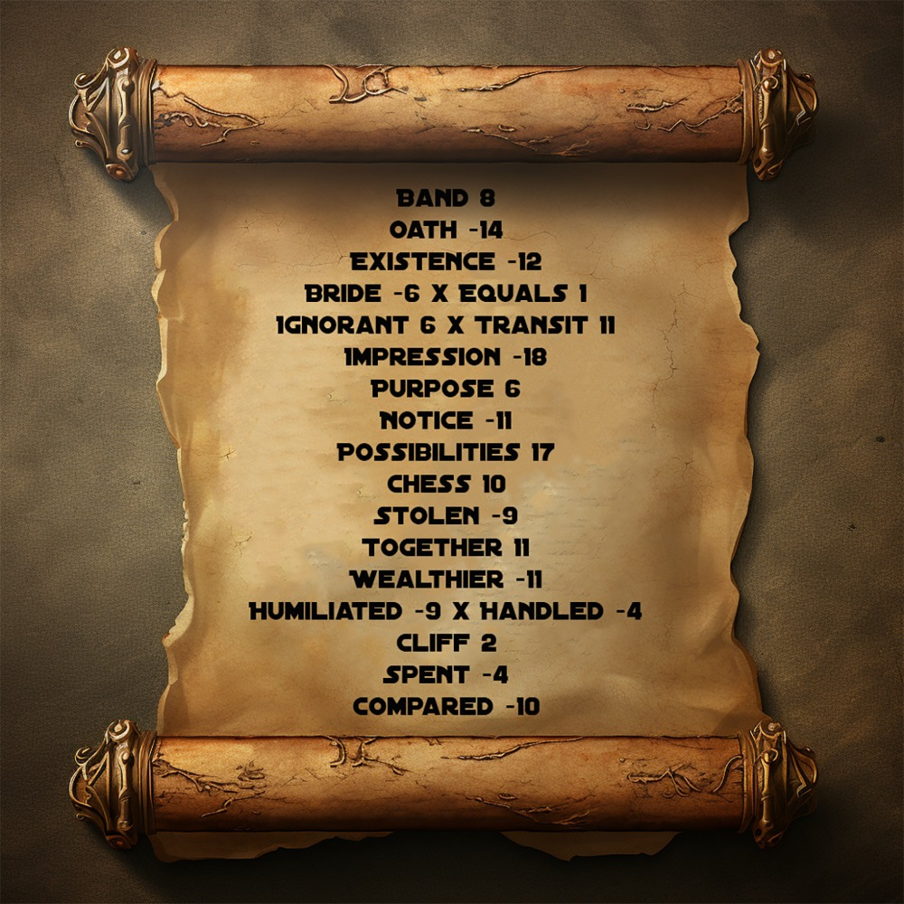
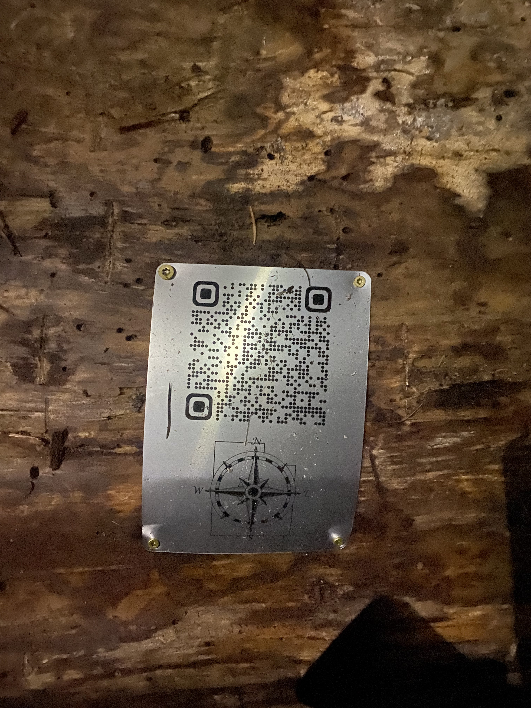

# QR 4




Book cipher all 20 words appear in the script for the count of monte cristo. (not the book)

## Solve

```bash
./search.sh monte debug
Report:
monte/movie.pdf has matches for 20 words.
```

This gives the gps cordinates

```
41.069472 n 
111.889351 w
```

```
ruby search-pdf.rb monte/movie.pdf
BAND: for
OATH: won
EXISTENCE: Oh
BRIDE: two
IGNORANT: three
IMPRESSION: is
PURPOSE: seven
NOTICE: two
POSSIBILITIES: one
CHESS: one
STOLEN: one
TOGETHER: eight
WEALTHIER: eight
CLIFF: Three
SPENT: Five
COMPARED: danglars
HUMILIATED: three
BRIDE x EQUALS: two - like
IGNORANT x TRANSIT: three - Im
HUMILIATED x HANDLED: three - Im
```

## QR



## Question

> Where are you

> Adam's Canyon trail