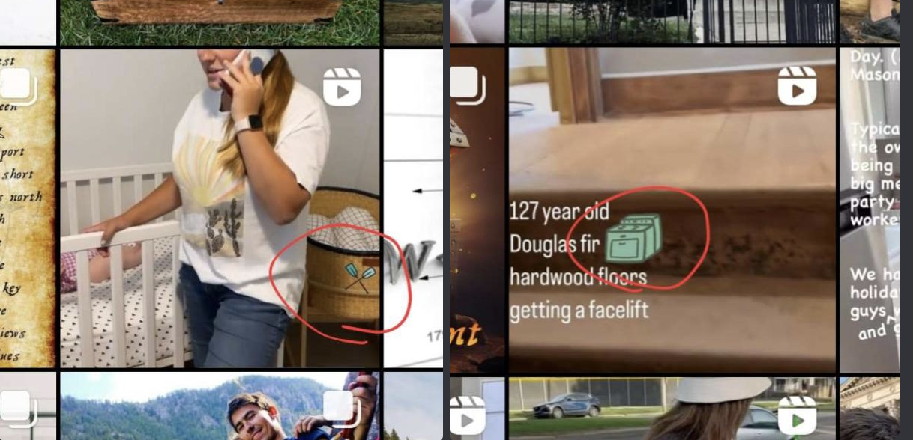
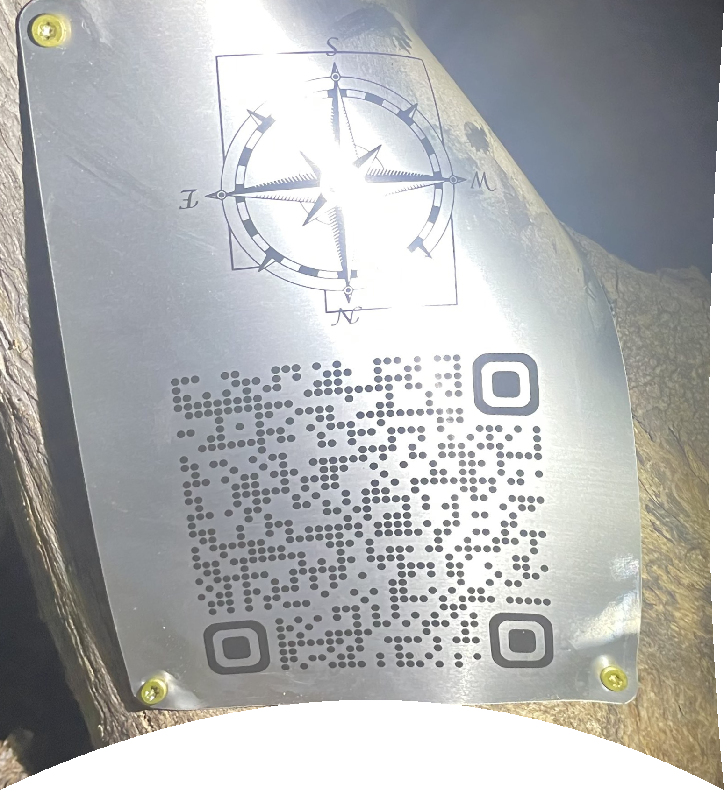

# 6 

Users had to wait 48 hour before viewing this code. 


## Clue

[./clue-good.jpg](./clue-good.jpg)

Note there was a bad clue that was posted first, but it was quickly replaced with this one.
See the bad clue at clue-bad.jpg

https://utahtreasurehunts.com/current-treasure-hunts/2023%20QR%20Code%20Treasure%20Hunt


```bash
11112262162217156517241716116
ozxokzpsruqfqmdfuzsqmpmcpxnem
````

## Solve

There were instagram stories that had green icons on them, only visible by when the story was paused.

[ore](https://www.instagram.com/p/CQSNK4WhNat/)



****
`Ore + Range = Orange`

Orange with [atbash cipher](https://www.dcode.fr/atbash-cipher) gives `lizmtv`

Some egyptian symbols are represented by 2 pairs

Pair them up like roman numeras where all numbers are less than 26

```
1 11 24 9 16 6 2 15 18 16 24 2 15 17
```

Do a [A1Z26](https://www.dcode.fr/letter-number-cipher) decrypt to get `AKXIPFBORPXBOQ`

The number 3 did not appear in the cipher, so [caesar cipher 3](https://www.dcode.fr/caesar-cipher) to get `DNALSIERUSAERT`

[Reverse cipher](https://www.dcode.fr/reverse-writing) `DNALSIERUSAERT` to get `TREASUREISLAND`


There is an instragram video by John with intentionally misspelled closed captions

The missing letters spell `ooo4eeyo(wtts)sp`


## Solve

## QR



https://utahtreasurehunts.com/current-treasure-hunts/ASmSe4whjpSlBMtArEhx/c3MWEansSAV7RJaduJJf

## Challenge Question

> What was Dave's wife standing next to in the reel with the oars?

> crib


## Winner

> DieselsPugs